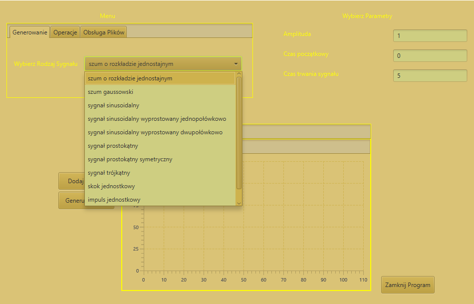
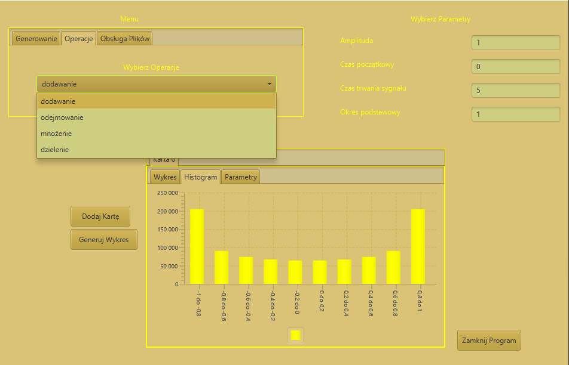
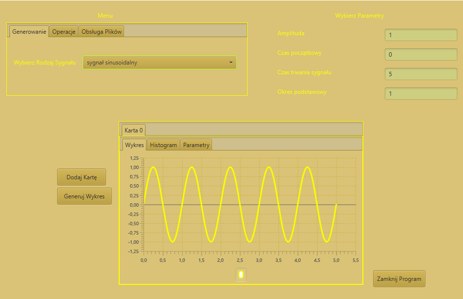
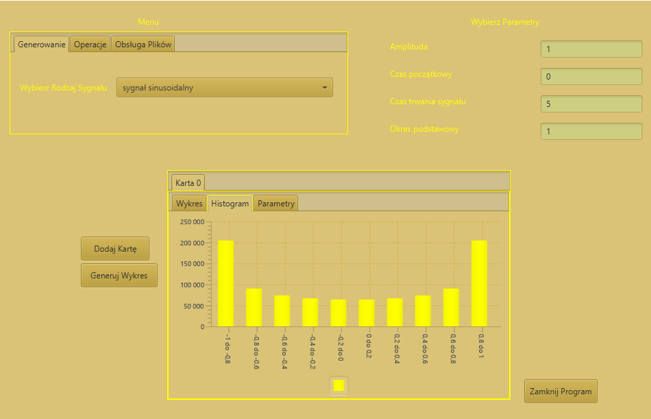

# digitalSignalProcessing

    
  <b>Obraz 1.</b>  Wygląd programu w wersji 1.

    
  <b>Obraz 2.</b>  Operacje na sygnałach.

    
  <b>Obraz 3.</b>  Wykres sygnału sinusoidalnego

    
  <b>Obraz 4.</b>  Histogram sygnału sinusoidalnego

