# digitalSignalProcessing

##  :low_brightness: Przetwarzanie sygnałów.

Aplikacja została napisana w języku JAVA, posiada interfejs graficzny napisany w JavaFX.  
Jej głównym zadaniem jest dostarczenie funkcjonalności w celu 
przetwarzania różnego rodzaju sygnałów. 

### Obecne funkcjonalności programu: 
* Generowanie sygnału 
* Utworzony histogram, podczas wygenerowania sygnału.
* Obliczona charakterystyka sygnału ( wartość średnia, bezwględna, moc średnia, wariancja , wartość skuteczna)
* Możliwe operacje arytmetyczne (dodawanie, odejmowanie, mnożenie, dzielenie sygnałów, splot, korelacja, korelacja z impl. splotu)
* Zapis / Odczyt wykresu do/z pliku binarnego.
* Modyfikacja sygnału, przetworzenie A/C (próbkowanie, kwantyzacja równomierna z zaokrągleniem, ekstrapolacja zerowego rzędu, rekonstrukcja w oparciu o funkcje sinc)
* Porównanie sygnałów.
* Filtrowanie sygnałów (Filtr Dolnoprzepustowy / Górnoprzepustowy) 
* Pomiar odległości (Doświadczenie z sygnałem odbitym od przeszkody)
* Dyskretna transformacja Fouriera (DFT)

W wersji pierwszej programu (branch: CPS_V1) utworzyłem bazę programu w celu jego dalszego rozwijania. 
Wówczas można było wygenerować sygnał, przejrzeć jego histogram, w którym można zauważyć ilość próbek sygnału w danym zakresie czasu, oraz charakterystykę.

W wersji drugiej programu (branch: CPS_V2) dodałem zakładkę: "Operacje 2", można w niej:
* próbkować sygnał
* skwantyzować równomiernie z zaokrągleniem
* wykorzystać ekstrapolacje zerwoego rzędu.
* rekonstruować sygnał w oparciu o funkcje sinc.

oraz zakładkę: "Porównanie", która przydaje się do zweryfikowania tego jak zmienił się nasz sygnał. Porównanie działa na zasazie nakładania się sygnałów.

W finalnej wersji programu (branch: CPS_Final), dodałem do programu filtr dolno i górno przepustowy oraz operację SPLOTu sygnału i korelację.
Dodatkiem była również funkcjonalność pomiaru odległości, gdzie za pomocą korelacji sygnałów, można utworzyć doświadczenie, w którym utworzony sygnał, odbije się od przeszkody,
następnie wracając w miejsce z którego ruszał. Dzięki korelacji i wcześniej ustawionych argumentów, można zobaczyć, jak dany sygnał się zmienił podczas odbicia od przeszkody, oraz oblcizyć odległość przeszkody od sygnału, co za tym idzie
również szybkość z jakim sygnał na daną przeszkodę natrafił. Taki pomiar odległości zaprezentowany jest na Obrazie X. 

Ostatnią implementacją w programie była funkcjonalność przetworzenia sygnału za pomocą dyskretnej transformacji Fouriera (DFT). 

  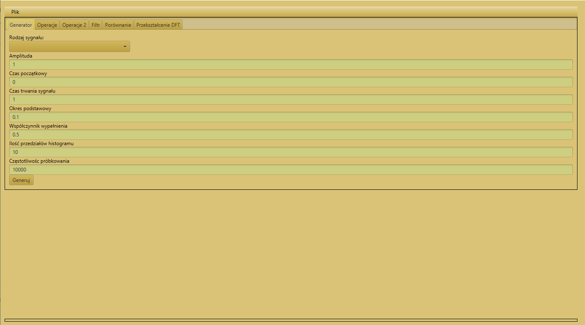  
  <b>Obraz 1.</b> Wygląd aplikacji

 

### :hammer_and_wrench: Dośw. 1  -  Zastosowanie filtru dolnoprzepustowego w celu wytłumienia składowej o wysokiej częstotliwości.
Na samym początku wygenerowałem dwa sygnały sinusoidalne o częstotliwości 100 Hz oraz 20 Hz, następnie je do siebie dodałem. 
W celu zaprezentowania działania fitlru, chcę wygasić z sumowanego sygnału częstotliwości 100 Hz, tak, żeby widoczna była składowa 20 Hz.

Wykorzystałem filtr dolnoprzepustowy, rząd filtra czyli liczbę próbek odpowiedzi impulsowej filtra ustawiłem na wysoką wartość 191, im wyższa wartość, tym dążymy do filtru idealnego.
Dlaczego (?) -> A no dlatego, że wykorzystamy znacznie większą złożoność obliczeniową, a spadek na wykresie zacznie się najbliżej miejsca odcięcia, co spowoduje, że zmniejszy się ryzyko na brak stłumienia składowej, którą chcemy zatrzymać.

  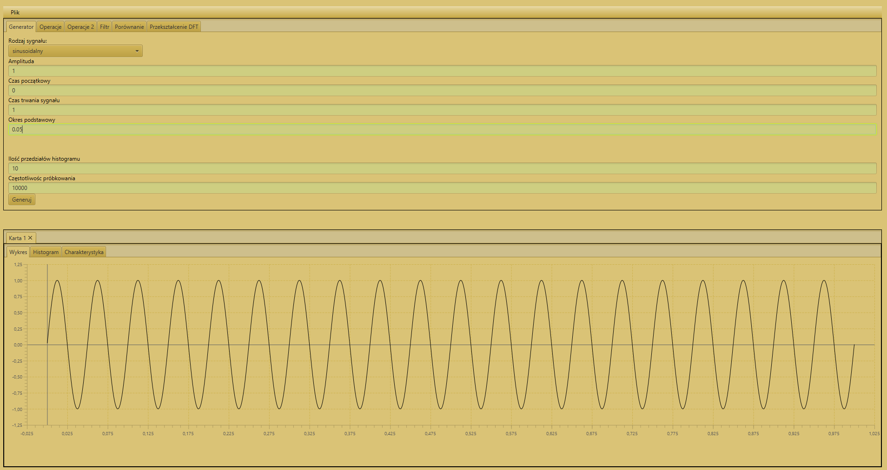  
  <b>Obraz 2.</b> Wykres sygnału sinusoidalnego o częstotliwości 20 Hz

  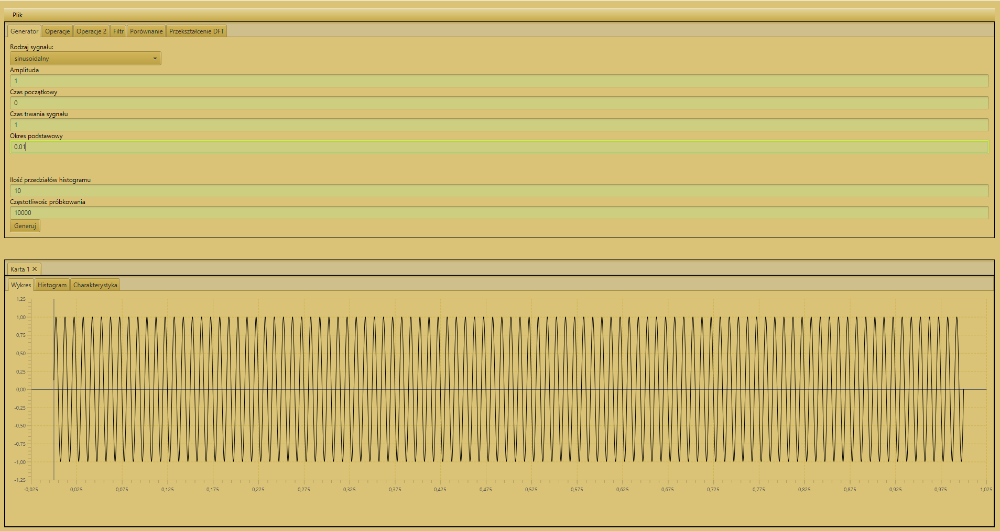  
  <b>Obraz 3.</b> Wykres sygnału sinusoidalnego o częstotliwości 100 Hz

  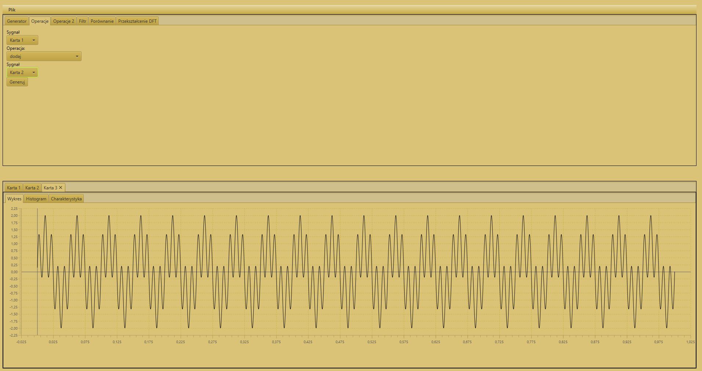  
  <b>Obraz 4.</b> Dodanie dwóch sygnałów sinusoidalnych (100 Hz + 20 Hz).

  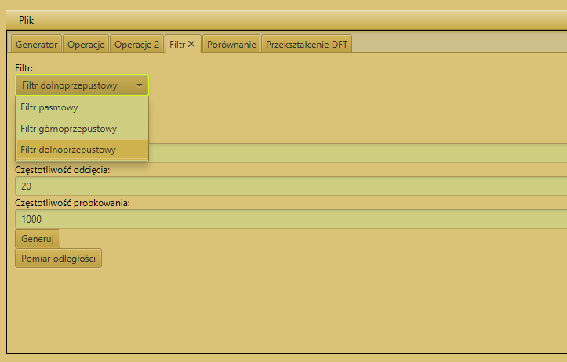  
  <b>Obraz 5.</b> Wykorzystany do doświadczenia - Filtr dolnoprzepustowy

  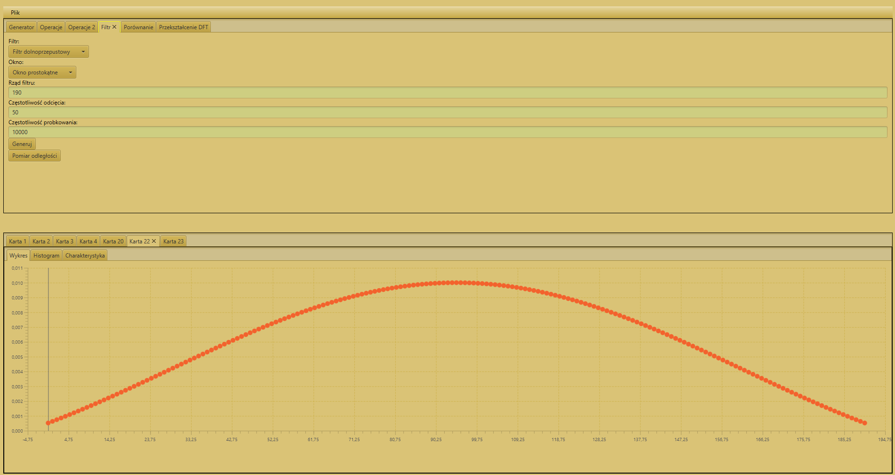  
  <b>Obraz 6.</b> Otrzymana odpowiedź impulsowa, po wykorzystaniu filtra dolnoprzepustowego.

Odpowiedź impulsową, którą otrzymałem po wykorzystaniu filtra dolnoprzepustowego na zsuomowanym sygnale (Obraz 4), muszę teraz spleść z sumowanym sygnałem.
W przypadku tej wersji programu, najpierw musiałem spróbkować zsumowany sygnał (Obraz 4), żeby splot wykonany był na tym samym typie sygnału (dyskretnym).

  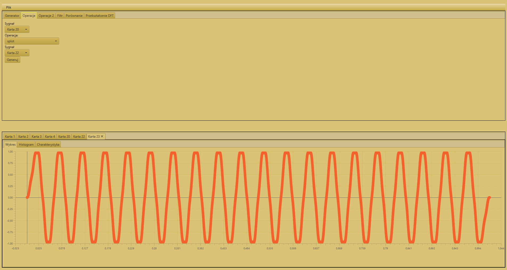  
  <b>Obraz 7.</b> Wynik zastosowanego filtru dolnoprzepustowego, na zsumowanym sygnale

Widać, że sygnał się zmienił. Czy tego oczekiwałem? Tak, na kolejnym obrazku gdzie wykonałem porównanie sygnału zsumowanego z tym finalnym (obraz  ), będzie można zaobserwować, że udało się wytłumić z sygnału składową 100 Hz, a została jedynie składowa o częst. 20 Hz

  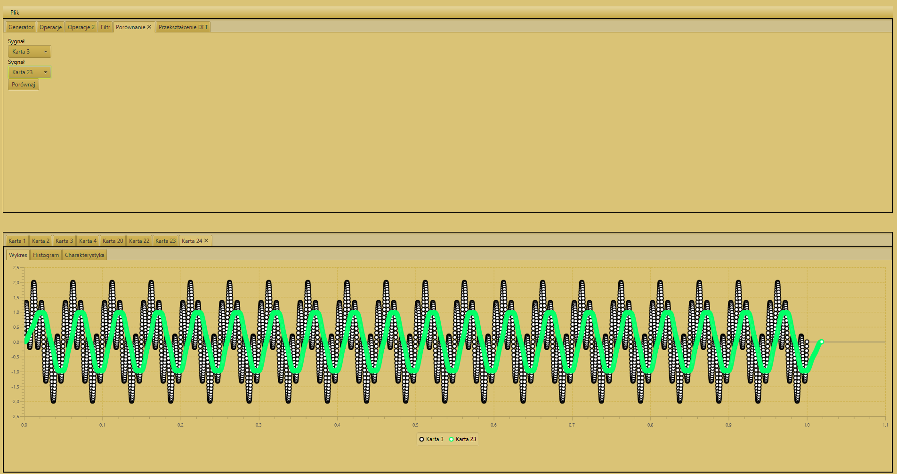  
  <b>Obraz 8.</b> Porównanie sygnału zsumowanego z sygnałem na którym zastosowaliśmy filtr dolnoprzepustowy

 

### :left_speech_bubble: Wniosek - :hammer_and_wrench: Dośw. 1
Filtr dolnoprzepustowy zadziałał prawidłowo, zmniejszył amplitudę wykresu, oraz ze względu na wysoko ustawiony rząd filtra, wytłumienie składowej 100 Hz z sygnału, jest naprawdę satysfakcjonujące. Gdybym ustawił mniejszy rząd filtra, np: 80 również bym wytłumił składową 100 Hz, natomiast sam efekt nie byłby tak "idealny", mówiąc krótko, mógłbym na sygnale zauważąć nadal pewne falowania mówiące o widoczności drugiej składowej, natomiast nadal byłby to wynik satysfakcjonujący.
Wartość miejsca odcięcia ustawiłem na 50, tak żeby znajdowała się pomiędzy jedną a drugą składową. Akceptowalne byłyby tu wartości od 40 do 60. 

### :hammer_and_wrench: Dośw. 2  -  Pomiar odległości przy zastosowaniu korelacji.
W programie zaimplementowana została funkcja do pomiaru odległości. Służy ona do "emulacji" sytuacji w której sygnał odbije się od przeszkody. Dzięki 
korelacji, można przeanalizować taką sytuację, czyli zweryfikować jak bardzo dany wykres się przesunął. Dzięki umieszczonej antenie, możemy wyliczyć odległośc przeszkody od miejsca z którego ruszał sygnał. 

  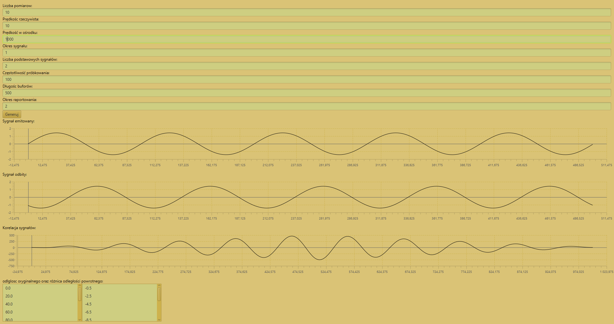  
  <b>Obraz 9.</b> Odbicie sygnału od przeszkody - Zastosowanie korelacji w celu pomiaru odległości. 

 

### :left_speech_bubble: Wniosek - :hammer_and_wrench: Dośw. 2
Na wykresie widać sygnał emitowany i odbity, poniżej widać korelacje czyli porównanie podobieństwa wykresów, na którym wyświetlone jest przesunięcie sygnału w czasie.
Odległość moglibyśmy wyliczyć, szukając na wykresie maksimum od antenty (w tym przypadku: ~474).

Więc w tej sytuacji wystarczy pooliczyć ilość próbek od antenty do maksimum prezentowanego na wykresie. Następnie wspomnianą ilość próbek podzielić na 2, dlaczego (?), a no dlatego, że sygnał musiał pokonać dwie drogi: -> Do przeszkody i -> od przeszkody.   Na samym końcu należałoby wspomnianą ilość próbek podzieloną podzieloną na 2 przemnożyć przez wartość argumentu  "prędkość w ośrodku". Czyli: (474,24 / 2) * 1000. Wynik wyszedłby w tym przypadku w skali m/s. 

### :hammer_and_wrench: Dośw. 3  - Dyskretne przekształcenie Fouriera -> DFT
W aplikacji zaimplementowałem DFT, jest to implementacja samodzielna (istnieje również możliwość zaimplementowania DFT z biblioteki). 

    
  <b>Obraz 10.</b> Dyskretne przekształcenie Fouriera - Doświadczenie na sygnale sinusoidalnym.

 

### :left_speech_bubble: Wniosek - :hammer_and_wrench: Dośw. 3
Dzięki temu przekształceniu możemy przetransformować sygnał x(t) z dziedziny czasu w dziedzinę częstotliwości, czyli, mówiąc "po ludzku", wyznaczyć jego widmo w postaci ciągłej. To z kolei pozwala nam określić zawartość częstotliwościową dowolnego sygnału nas interesującego.

Za pomocą rozbicia sygnału na składowe:
* Część rzeczywistą
* Część urojoną
* Moduł liczby zespolonej
* Argument liczby zespolonej

Możemy zweryfikować również, czy nie wystąpił na przykład: wyciek danych. 

### Ciekawostki. 

#### Ciekawostka 1.
W celu zrealizowania doświadczenia 2, czyli wykorzystania filtru dolnoprzepustowego, należało najpierw zsumowany sygnał spróbkować, żeby móć go spleść z odpowiedzą impulsową filtru dolnoprzepustowego. Zwiazane jest to z faktem, iż chcemy tutaj dokonać splotu dyskretnego, więc potrzebujemy wykorzystać do tego sygnały dyskretne.

    
  <b>Obraz 10.</b> Dodanie dwóch sygnałów sinusoidalnych (100 Hz + 20 Hz).

  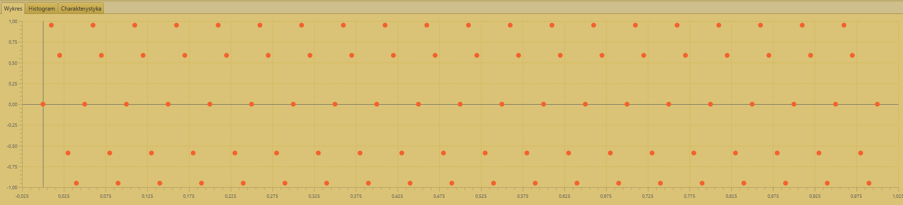  
  <b>Obraz 11.</b> Spróbkowany sygnał sinusoidalny (100 Hz + 20 Hz) -> Obraz 10.

  

#### Ciekawostka 2.
Przy generowaniu sygnału, wpisujemy w polu: "Ilość przedziałów histogramu" pewną wartość, oznacza ona ilość zakresów w których mieszczą się próbki. Mówiąc krótko, jeśli wpiszemy 10, wówczas na wykresie histogramu będziemy mieć oś czasu podzieloną na 10 słupków -> czyli zakresów na osi odciętych. 

Program posiada funkcjonalność, która pozwala na edycję wykresu w czasie rzeczywistym. Poniżej zaprezentuję przykład.

* Generuje losowy sygnał, w tym przypadku sygnał gaussowski, wraz z wartością 10 w polu "Ilość przedziałów histogramu"

  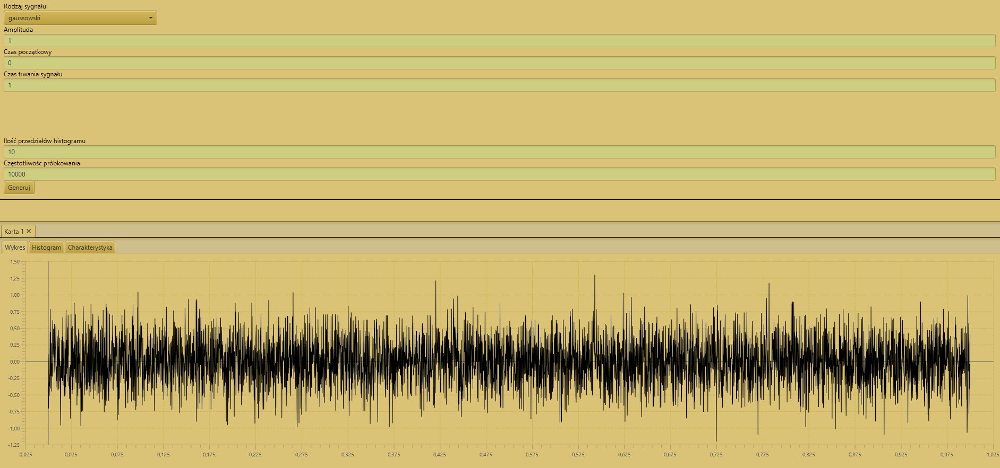  
  <b>Obraz 12.</b> Wygenerowany sygnał gaussowski. 

  

* Sprawadzam histogram

  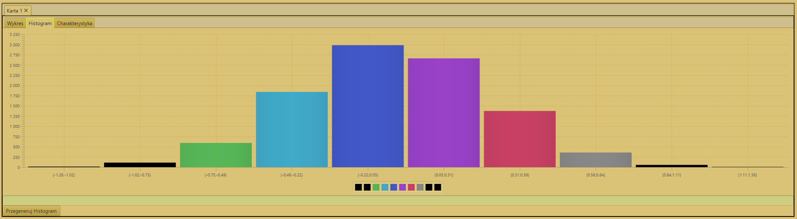  
  <b>Obraz 13.</b> Wygenerowany sygnał gaussowski. 

  

Histogram został wygenerowany prawidłowo. Widać na nim 10 słupków, prezentujących ilość próbek w danym zakresie na osi X. 

    
  <b>Obraz 14.</b> Histogram sygnału gaussowskiego - Ilość przedziałów: 10

  

    
  <b>Obraz 15.</b> Przegenerowany histogram - Ilość przedziałów: 20

  

