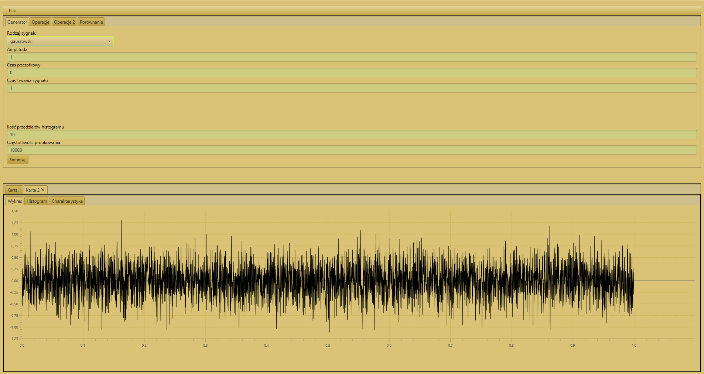
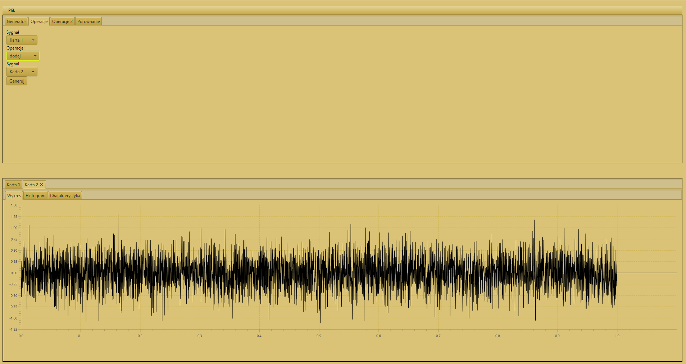
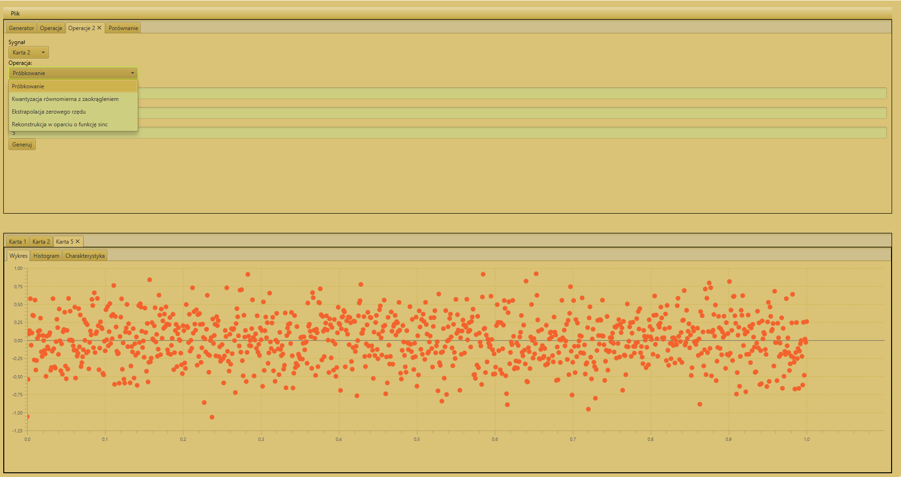
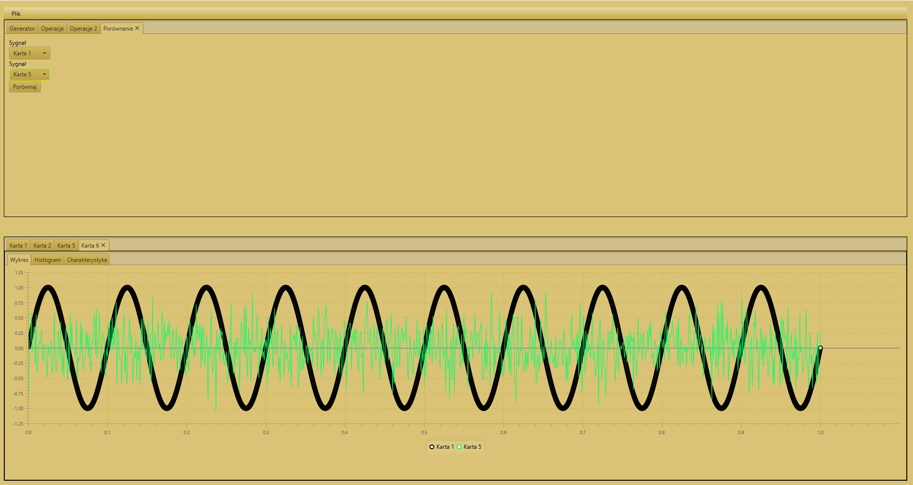

# digitalSignalProcessing

##  :low_brightness: Zadanie v2

Dalsza część programu w której dodaliśmy zakładkę: "Operacje 2", można w niej:
* próbkować sygnał
* skwantyzować równomiernie z zaokrągleniem
* wykorzystać ekstrapolacje zerwoego rzędu.
* rekonstruować sygnał w oparciu o funkcje sinc.

oraz zakładkę: "Porównanie", która przydaje się do zweryfikowania tego jak zmienił się nasz sygnał. Na obrazku, akurat nie wykonałem rekonstrukcji, natomiast
pokazałem sam koncept działania porównania. Na obrazku 4 widać, porównanie sygnału sinusoidalnego i szumu gaussowskiego. Porównanie działa na zasazie nakładania się sygnałów.

## Obecne funkcjonalności programu: 
* Generowanie sygnału 
* Utworzony histogram, podczas wygenerowania sygnału.
* Obliczona charakterystyka sygnału ( wartość średnia, bezwględna, moc średnia, wariancja , wartość skuteczna)
* Możliwe operacje arytmetyczne (dodawanie, odejmowanie, mnożenie, dzielenie sygnałów)
* Zapis / Odczyt wykresu do/z pliku binarnego.
* Modyfikacja sygnału, przetworzenie A/C
* Porównanie sygnałów.

    
  <b>Obraz 1.</b>  Wygląd programu w wersji 2. - Wygenerowany szum gaussowski

    
  <b>Obraz 2.</b> Operacje arytmetyczne na sygnałach (nie zmieniło się od v1)

    
  <b>Obraz 3.</b> Operacje 2 - Przetworzenie A/C + Rekonstrukcja

    
  <b>Obraz 4.</b> Porównanie sygnałów. -> W celu zmodyfikowania sygnału i zweryfikowania zmian.

