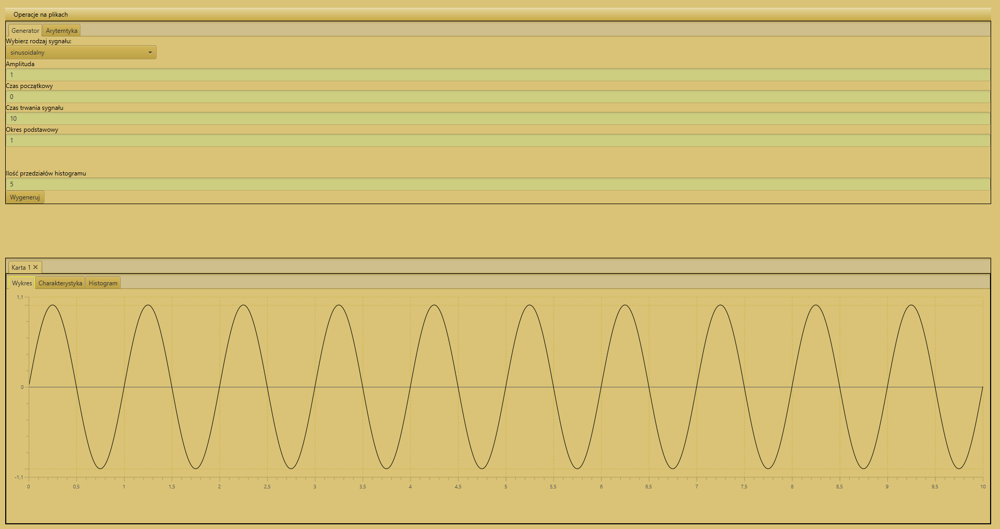
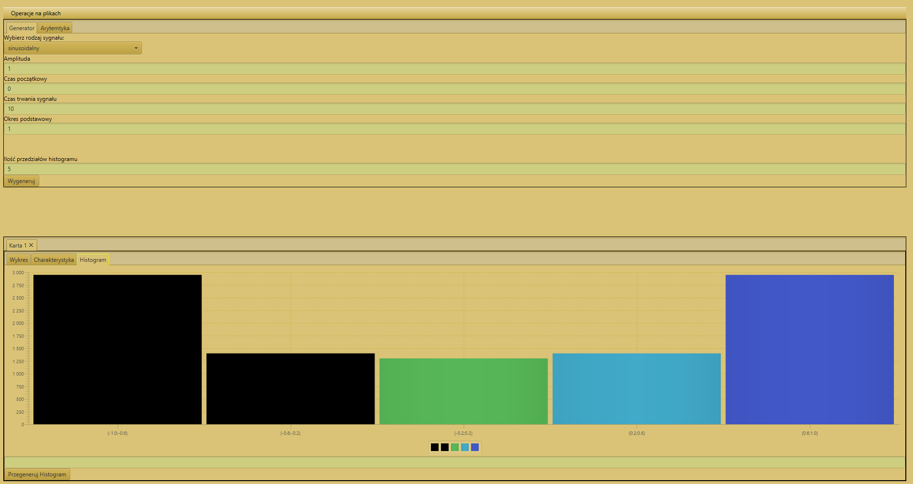
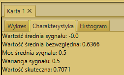
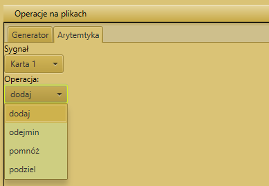
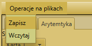

# digitalSignalProcessing

Utworzona baza programu, w tej wersji można wygenerować różnego rodzaju wykres, zarówno ciągły w czasie jak i dyskretny. Program utworzony w taki sposób, żeby
w dalszych częściach móc go rozwijać i dodawać kolejne funkcjonalności. 

## Obecne funkcjonalności programu: 
* Generowanie sygnału 
* Utworzony histogram, podczas wygenerowania sygnału.
* Obliczona charakterystyka sygnału ( wartość średnia, bezwględna, moc średnia, wariancja , wartość skuteczna)
* Możliwe operacje arytmetyczne (dodawanie, odejmowanie, mnożenie, dzielenie sygnałów)
* Zapis / Odczyt wykresu do/z pliku binarnego.

    
  <b>Obraz 1.</b>  Wygląd programu w wersji 1.

    
  <b>Obraz 2.</b>  Histogram sygnału sinusoidalnego

    
  <b>Obraz 3.</b> Charakterystyka sygnału

    
  <b>Obraz 4.</b> Możliwe operacje na sygnałach.

    
  <b>Obraz 4.</b> Zapis / Odczyt z pliku binarnego

